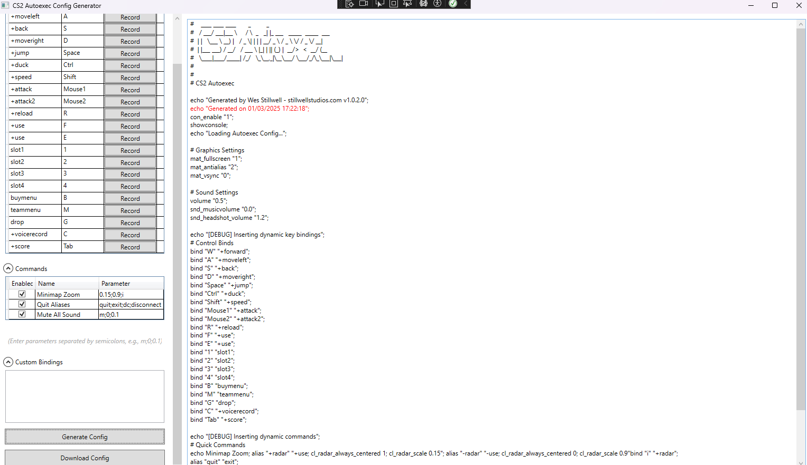

# CS2QuickSetup



## Overview
CS2QuickSetup is a tool designed to simplify the process of configuring Counter-Strike 2 (CS2). The primary feature is the **CS2 Config Creator**, a WPF application that allows users to dynamically generate and manage CS2 configurations, including key bindings and command aliases. This replaces the previous static configurations but retains compatibility for those who still prefer them.

Developed by **Wes Stillwell** from **Stillwell Studios**.

## Features
- **CS2 Config Creator (WPF App)**: Generate dynamic CS2 configurations with an intuitive UI.
- **Customizable Keybindings & Commands**: Modify and extend the default settings easily via JSON configuration files.
- **Live Preview & Diff**: View changes before saving configurations.
- **Export to Autoexec.cfg**: Save and apply configurations directly to CS2.
- **Static Config Compatibility**: Use predefined configs if desired.

## Download and Installation
1. **Download the Latest Release**
   - Go to the **[Releases](https://github.com/gxrwes/CS2QuickSetup/releases/latest)** page.
   - Download the latest **release.zip** file.
   - Extract the contents to a folder of your choice.

2. **Run CS2 Config Creator**
   - Double-click `ConfigCreator.App.exe` to start the application.
   - Ensure you have .NET 6.0 installed if prompted.

## Using CS2 Config Creator

### Key Features in the UI
- **Key Bindings Tab**
  - Displays a list of default key bindings.
  - Edit existing bindings or record new key assignments.
  - Changes are reflected in real-time in the preview panel.

- **Commands Tab**
  - View, enable, and modify CS2 commands.
  - Each command has parameters that can be adjusted.

- **Custom Bindings**
  - Add manual bindings or aliases.

- **Live Preview**
  - Displays a preview of the generated `autoexec.cfg`.
  - Highlights changes compared to the previous configuration.

- **Generate & Save Configuration**
  - Click **Generate Config** to create an updated `autoexec.cfg`.
  - Click **Download Config** to save the file.

## Customizing Configurations
The application loads default settings from two JSON files:
- **defaultKeybinds.json**: Defines default key bindings.
- **defaultCommands.json**: Defines available commands and their parameters.

### Adding or Modifying Key Bindings
To add a new key binding, edit `defaultKeybinds.json`:
```json
[
    {
        "Key": "H",
        "Value": "+jumpthrow"
    }
]
```

### Adding or Modifying Commands
Modify `defaultCommands.json`:
```json
[
    {
        "Name": "Toggle FPS Counter",
        "CommandBase": "cl_showfps {0}",
        "Parameters": [
            "0",
            "1"
        ],
        "ParameterDescription": [
            "Off",
            "On"
        ]
    }
]
```

## Using Static Configs (Optional)
If you prefer static configurations, copy the desired `.cfg` file from the `cs2` folder to:
```
C:\Program Files (x86)\Steam\steamapps\common\Counter-Strike Global Offensive\game\csgo\cfg
```
Then execute it in the CS2 console:
```
exec "your_config"
```
For example:
```
exec a
```

## Auto-Executing Configurations on Startup
1. Open **Steam** > **Library**.
2. Right-click **Counter-Strike 2** > **Properties**.
3. In the **General** tab, under **Launch Options**, add:
   ```
   -exec autoexec.cfg
   ```
4. Additional options:
   ```
   -novid -exec autoexec.cfg -freq 144 -nojoy -high
   ```

## Contributing & Development
### Building from Source
1. Clone the repository:
   ```
   git clone https://github.com/gxrwes/CS2QuickSetup.git
   ```
2. Restore dependencies:
   ```
   dotnet restore ConfigCreator/ConfigCreator.sln
   ```
3. Build and run:
   ```
   dotnet run --project ConfigCreator.App
   ```

### Automated Builds & Testing
The project uses GitHub Actions to automate builds and tests. Every pull request triggers a workflow that:
- Builds the WPF app.
- Runs unit tests.
- Creates a ZIP archive for release.

## Support
For issues and feature requests, create an issue on **[GitHub Issues](https://github.com/gxrwes/CS2QuickSetup/issues)**.

## License
This project is licensed under the **Good Luck With That License**.

---
_This README was last updated on [DATE]._

